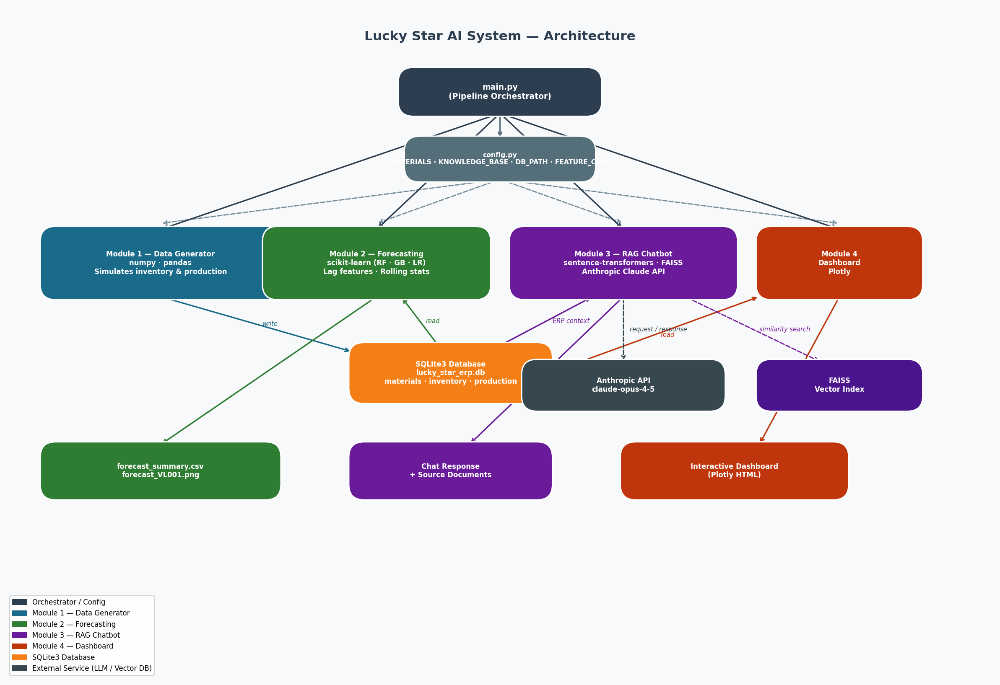

# Lucky Star AI System — ERP Mini Project

A simulated AI-integrated ERP system for a garment factory, combining **inventory forecasting** and an **internal RAG chatbot** to support production and operations management.

---

## Modules

| # | Module | Description |
|---|--------|-------------|
| 1 | **Data Generator** | Simulates ERP data (inventory, production orders) and persists to SQLite3 |
| 2 | **Forecasting** | Feature engineering + ML models (Random Forest, Gradient Boosting, Linear Regression) to forecast inventory 30 days ahead |
| 3 | **RAG Chatbot** | FAISS vector store + multilingual embeddings + LLM (Anthropic Claude) for internal Q&A |
| 4 | **Dashboard** | Plotly interactive dashboard combining live DB data and ML forecasts |

---

## Project Structure

```
Demo_chatbot/
├── .gitignore
├── config.py                     # Shared config: DB path, materials, knowledge base
├── main.py                       # Runs the full pipeline (Modules 1 → 4)
├── requirements.txt
├── lucky_star_ai_project.ipynb   # Original notebook (reference)
│
├── data/
│   ├── .gitkeep
│   ├── lucky_star_erp.db         # SQLite3 DB — generated at runtime (gitignored)
│   ├── forecast_summary.csv      # Forecast output — generated at runtime
│   └── forecast_VL001.png        # Forecast chart — generated at runtime (gitignored)
│
└── modules/
    ├── __init__.py
    ├── data_generator.py         # Module 1: simulate & save ERP data to SQLite3
    ├── forecasting.py            # Module 2: feature engineering + ML forecast
    ├── rag_chatbot.py            # Module 3: FAISS vector store + RAG chat
    └── dashboard.py              # Module 4: Plotly dashboard
```

---

## Getting Started

### 1. Install dependencies

```bash
pip install -r requirements.txt
```

### 2. Run the full pipeline

```bash
python main.py
```

This will:
- Generate simulated ERP data and save it to `data/lucky_star_erp.db`
- Train ML models and produce `data/forecast_summary.csv` and a forecast chart
- Run the RAG chatbot demo (mock mode by default)
- Render the Plotly dashboard

### 3. Enable the real LLM (optional)

Set your Anthropic API key before running:

```bash
# Windows
set ANTHROPIC_API_KEY=sk-ant-...
python main.py

# macOS / Linux
ANTHROPIC_API_KEY=sk-ant-... python main.py
```

### 4. Run individual modules

Each module can be executed independently:

```bash
python modules/data_generator.py   # Module 1 only
python modules/forecasting.py      # Module 2 only
python modules/rag_chatbot.py      # Module 3 only (mock mode)
python modules/dashboard.py        # Module 4 only
```

---

## Architecture



> Generated by `generate_diagram.py`. Re-run `python generate_diagram.py` to refresh.

---

## Tech Stack

| Layer | Library |
|-------|---------|
| Data & DB | `pandas`, `numpy`, `sqlite3` |
| Machine Learning | `scikit-learn` (Random Forest, Gradient Boosting) |
| Vector Search | `faiss-cpu`, `sentence-transformers` |
| LLM | Anthropic Claude (`claude-opus-4-5`) |
| Visualization | `matplotlib`, `plotly` |

---

## Key Highlights

- **SQLite3** stores all ERP data — each module reads directly from the DB, no inter-module coupling
- **Multilingual embeddings** (`paraphrase-multilingual-MiniLM-L12-v2`) support Vietnamese-language queries
- **Feature engineering** with lag features and rolling statistics for time-series forecasting
- **RAG** combines internal SOPs + live ERP snapshots into the LLM context
- Architecture is designed to be extensible toward a real Odoo API + PostgreSQL backend
